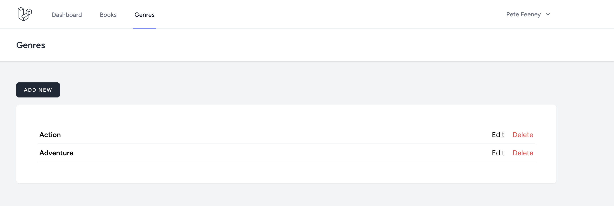
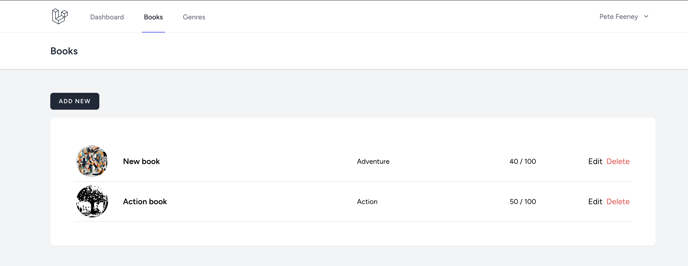

# TAK-21 Test

## Prerequisites

- PHP `^8.1`
- Node `^18.x`
- Composer `^2.x`
- PHP extensions `BCMath, Ctype, cURL, DOM, Fileinfo, JSON, Mbstring, OpenSSL, PCRE, PDO, Tokenizer, XML`

### Refrences
- [Server Requirements](https://laravel.com/docs/10.x/deployment#server-requirements)
- [How to install all required PHP extensions for Laravel?](https://stackoverflow.com/questions/40815984/how-to-install-all-required-php-extensions-for-laravel)
- [Composer](https://getcomposer.org/)
- [How To Install Node.js](https://www.digitalocean.com/community/tutorial-collections/how-to-install-node-js)

## Getting started
1. Clone the repository
2. Run `composer install` & `npm i`
3. Create `.env` file based on the `.env example`
4. Run `php artisan migrate` & `php artisan db:seed`
5. Create a new branch with your first and last name e.g `ralf-heinsoo`

On success you should be able to log in with the following credentials:
- E-mail: `test@user.ee`
- Password: `test@user.ee`

## Workflow

Complete the assignments one at a time and in the numeric order.

Make a commit & push changes to your branch after every assignment.

# Assignment
## Context
The end result should be a digital library where user can add books and categorize them by genre.

## 1. Models, migrations & controllers
The digtal library should have books categorized by genres.

To achive this, do the following:

1. **Create 2 models:**
- `Book`
- `Genre`

2. **Create migrations for the models**
- `Genres` table should have the following fields:

    `id`, `name`, `created_at`,`updated_at`

- `Books` table should have the following fields:

    `id`,`genre_id`,`title`,`description`,`image_path`,`rating`,    `created_at`,`updated_at`

3. **Create `resource` controllers for both of these models.**

### Resources
- [Generating Model Classes](https://laravel.com/docs/10.x/eloquent#generating-model-classes)
- [Migrations:Columns](https://laravel.com/docs/10.x/migrations#main-content)
- [Resource Controllers](https://laravel.com/docs/10.x/controllers#resource-controllers)

## 2. Routes and navigation
_**Authenticated** user should be able to see books & genres navigation elements in the navbar._

1. **Implement routes for all the resource controller actions.**

    **!!** Make sure to name the routes.

2. **Add `Books` & `Genres` navigation elements to the authenticated users navbar.**

    Find the correct place to add the navigation links and add utilize the `route()` helper method with the correct route name to get the `href` value.

The end result should look like this: 

### Resources
- [Actions Handled By Resource Controller](https://laravel.com/docs/10.x/controllers#actions-handled-by-resource-controller)
- [Named Routes](https://laravel.com/docs/10.x/routing#named-routes)
- [Route(): helper method](https://github.com/tighten/ziggy)

## 3. Genres - Index (Vue)
_User should be able to navigate to the Genres page and see a list of genres, a "Add new genre" button and edit, delete actions for each individual genre._

1. **Create an index page for the genres and render the page using the correct controller action.**

    Make sure that the genres index view extends `AuthenticatedLayout.vue`

2. **Pass genres along to the frontend.**

    Check the [Creating pages example](https://inertiajs.com/pages#creating-pages) to see how `user` is passed down from controller to the frontend view as a refrence.

3. **Add the following elements to the page**
    - Heading "Genres"
    - "Add genre" link
    - A list of genres (At this step use fake data for the list)
    - "edit" & "delete" actions for each list element. (also placeholders)

Genres page

### Resources
- [Creating pages example](https://inertiajs.com/pages#creating-pages)
- [Inertia: Link](https://inertiajs.com/links)

## 4. Genres - Create (Vue)
- _By clicking on the "Add genres" button user should be redirected to a create genres form._
- _User should be able to see validation error for the "name" field when submiting an empty form_
- _On a successful form submission, user should be redirected back to the index view and the new entry should be visible in the list._

1. **Add a Create page for the "add new genre" form and render the page using the correct controller action.**

2. **Implement the form using `useForm()` helper method**

    Check the inertia docs for form helper method or use Login & Register forms as a guide.

3. **Submit the form to the correct controller action**

4. **Add validation & creation logic to to the controller action**

5. **Replace the placeholder data in the index views list with the newly created genre**

### Resources
- [useForm(): helper method](https://inertiajs.com/forms#form-helper)
- [Inserting & updating models](https://laravel.com/docs/10.x/eloquent#inserting-and-updating-models)
- [Laravel: Validation](https://laravel.com/docs/10.x/validation)

## 5. Genres - Edit & delete (Vue)
- _By clicking on the "Edit" button user should be redirected to a edit genre form._
- _On a successful form submission, user should be redirected back to the index view and the changed entry should be visible in the list._
- _By clicking on the "Delete" button user should be able to delete a genre from the list._

1. **Add a Edit page for the "edit genre" form and render the page using the correct controller action.**

2. **Implement the form using `useForm()` helper method**

    Check the inertia docs for form helper method or use Login & Register forms as a guide.

3. **Submit the form to the correct controller action**

4. **Add validation & updating logic to to the controller action**

6. **Add edit & delete actions for the list element**

    Use the `route()` helper method to bind the `href` values.
    
    Implement the delete action using Inertia `<Link>` element. [Link method](https://inertiajs.com/links#method)

    **!!** Use the correct HTTP method for delete action.
### Resources
- [useForm(): helper method](https://inertiajs.com/forms#form-helper)
- [Inserting & updating models](https://laravel.com/docs/10.x/eloquent#inserting-and-updating-models)
- [Deleting Models](https://laravel.com/docs/10.x/eloquent#deleting-models)

## 6. Books - Index (Vue)
_User should be able to navigate to the Books page and see a list of books, a "Add new book" button and edit, delete buttons for each individual book._

1. **Add a model relation between books and genres.**

2. **Create a books index page based on the screenshot below.**

   **!!** Use the genres index page as a refrence. (Step 3.)
    
    The list should include: image, title, **genre**, rating for each book. (Placeholders at this step.)

### Resources
- [Eloquent: Relationships](https://laravel.com/docs/10.x/eloquent-relationships)
- [The Public Disk](https://laravel.com/docs/10.x/filesystem#the-public-disk)

## 7. Books - Create (Vue)
- _By clicking on the "Add new" button user should be redirected to a create book form._
- _User should be able to see validation error for the form fields when submiting an empty form_
- _On a successful form submission, user should be redirected back to the index view and the new entry should be visible in the list._

1. **Create a form for adding new books.**

    Validation rules for the form:
    - All fields are required
    - Rating should have a max value of 100.

    Use the screenshot as a guide.

    Refrence the genres create form for help.(Step 4.)

    **!!** For image uploads read the Inertia docs on [File upload: Inertia](https://inertiajs.com/file-uploads#file-upload-example) & for server side file handling read the Laravel docs on [File upload: Laravel](https://laravel.com/docs/10.x/filesystem#file-uploads)

2. **Replace the placeholder data in the index views list with the newly created book (make sure to include the genre)**
### Resources
- [useForm(): helper method](https://inertiajs.com/forms#form-helper)
- [File upload: Inertia](https://inertiajs.com/file-uploads#file-upload-example)
- [File upload: Laravel](https://laravel.com/docs/10.x/filesystem#file-uploads)
- [Inserting & updating models](https://laravel.com/docs/10.x/eloquent#inserting-and-updating-models)
- [Laravel: Validation](https://laravel.com/docs/10.x/validation)

## 8. Books - edit & delete (Vue)
- _By clicking on the "Edit" button user should be redirected to a edit genre form._
- _On a successful form submission, user should be redirected back to the index view and the changed entry should be visible in the list._
- _By clicking on the "Delete" button user should be able to delete a book from the list._

1. **Add edit & delete actions for the books**

    Refrence (step 5.) for help.

    **!!** While updating the image for a book entry, make sure that the old image is also deleted from the storage.

    Choose the correct HTTP method for the actions.

    Read about [Multipart limitations](https://inertiajs.com/file-uploads#multipart-limitations) for guidance.

### Resources
- [useForm(): helper method](https://inertiajs.com/forms#form-helper)
- [Inserting & updating models](https://laravel.com/docs/10.x/eloquent#inserting-and-updating-models)
- [Deleting Models](https://laravel.com/docs/10.x/eloquent#deleting-models)
- [Multipart limitations](https://inertiajs.com/file-uploads#multipart-limitations)

